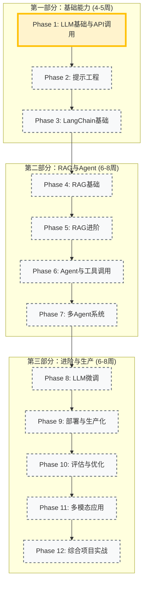
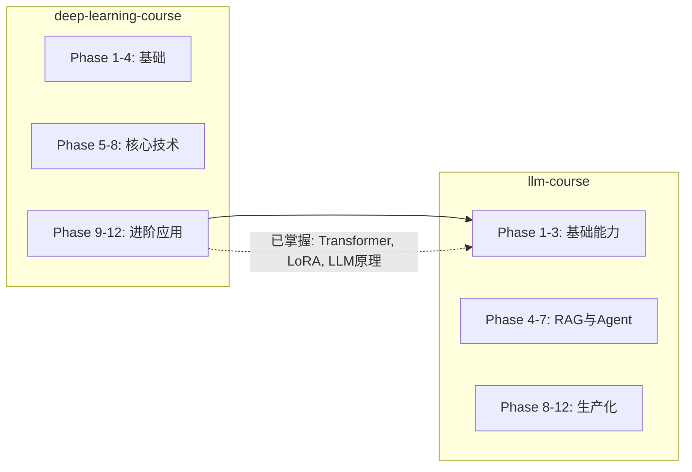

# 🗺️ 大模型应用开发课程路线图

> **当前状态**: 🚀 准备开始第 1 阶段 (LLM 基础与 API 调用)
> **总体进度**: 0% (完成 0/12 阶段)

## 📅 学习路径概览

---

## 📍 详细里程碑

### ⏳ 第一部分：基础能力 (Phase 1-3)

建立大模型应用开发的核心基础。

- **Phase 1**: LLM API 调用（OpenAI、Claude、Gemini、本地模型）
- **Phase 2**: 提示工程（Few-shot、CoT、结构化输出）
- **Phase 3**: LangChain 框架（Chains、Memory、Output Parsers）

### 🔮 第二部分：RAG 与 Agent (Phase 4-7)

掌握 RAG 和 Agent 核心技术。

#### Phase 4: RAG 基础

- [ ] 文档加载与分割
- [ ] 向量存储（Chroma、Pinecone）
- [ ] 检索与生成
- [ ] **实战**: 个人知识库问答系统

#### Phase 5: RAG 进阶

- [ ] 混合检索与重排序
- [ ] 查询优化技术
- [ ] 上下文压缩
- [ ] **实战**: 企业级文档问答系统

#### Phase 6: Agent 与工具调用

- [ ] ReAct Agent
- [ ] 工具定义与调用
- [ ] OpenAI Function Calling
- [ ] **实战**: 自动化研究助手

#### Phase 7: 多 Agent 系统

- [ ] LangGraph 基础
- [ ] Agent 协作模式
- [ ] 人机协作
- [ ] **实战**: AI 内容创作团队

### 🚀 第三部分：进阶与生产 (Phase 8-12)

工业级能力培养。

#### Phase 8: LLM 微调

- [ ] LoRA / QLoRA
- [ ] 数据集准备
- [ ] 监督微调与 DPO
- [ ] **实战**: 领域特定助手微调

#### Phase 9: 部署与生产化

- [ ] 模型量化
- [ ] vLLM / TGI 部署
- [ ] FastAPI 服务化
- [ ] Docker / K8s

#### Phase 10: 评估与优化

- [ ] 自动评估
- [ ] Ragas 评估框架
- [ ] 成本优化

#### Phase 11: 多模态应用

- [ ] GPT-4V / Claude Vision
- [ ] 文档 OCR
- [ ] 语音集成

#### Phase 12: 综合项目实战

- [ ] 企业级知识库系统
- [ ] AI 客服系统
- [ ] 代码助手
- [ ] 个人 AI 助理

---

## 🏆 实战项目规划

| 项目                   | 对应阶段 | 核心技术点    | 状态      |
| :--------------------- | :------- | :------------ | :-------- |
| **多模型对比应用**     | Phase 1  | LLM API 调用  | ⏳ 待开始 |
| **智能客服提示词系统** | Phase 2  | 提示工程      | ⏳ 待开始 |
| **多轮对话机器人**     | Phase 3  | LangChain     | ⏳ 待开始 |
| **个人知识库**         | Phase 4  | RAG 基础      | ⏳ 待开始 |
| **企业文档问答**       | Phase 5  | RAG 进阶      | ⏳ 待开始 |
| **自动化研究助手**     | Phase 6  | Agent         | ⏳ 待开始 |
| **AI 内容创作团队**    | Phase 7  | 多 Agent      | ⏳ 待开始 |
| **领域特定助手**       | Phase 8  | LoRA 微调     | ⏳ 待开始 |
| **LLM API 服务平台**   | Phase 9  | vLLM, FastAPI | ⏳ 待开始 |
| **评估仪表板**         | Phase 10 | Ragas         | ⏳ 待开始 |
| **多模态文档助手**     | Phase 11 | Vision LLM    | ⏳ 待开始 |
| **企业级知识库系统**   | Phase 12 | 综合          | ⏳ 待开始 |

---

## 🔗 与 deep-learning-course 的关系

---

> _此路线图基于 `LEARNING_PLAN.md` 生成，随学习进度动态更新。_
