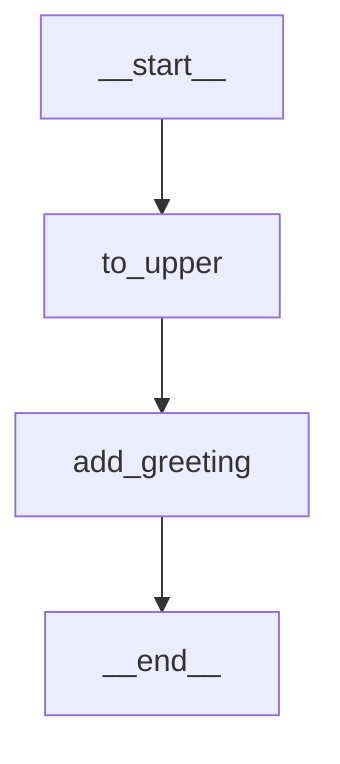

# LangGraph 深入解析：从零到精通

---

## 目录

- [一、LangGraph 是什么？](#一langgraph-是什么)
- [二、为什么需要 LangGraph？](#二为什么需要-langgraph)
- [三、核心概念](#三核心概念)
- [四、环境安装](#四环境安装)
- [五、第一个 LangGraph 应用](#五第一个-langgraph-应用)
- [六、State（状态）详解](#六state状态详解)
- [七、Node（节点）详解](#七node节点详解)
- [八、Edge（边）详解](#八edge边详解)
- [九、条件边与路由](#九条件边与路由)
- [十、Checkpointer 与记忆持久化](#十checkpointer-与记忆持久化)
- [十一、Human-in-the-Loop（人机协作）](#十一human-in-the-loop人机协作)
- [十二、SubGraph（子图）](#十二subgraph子图)
- [十三、完整实战：ReAct Agent](#十三完整实战react-agent)
- [十四、完整实战：多智能体协作](#十四完整实战多智能体协作)
- [十五、Streaming（流式输出）](#十五streaming流式输出)
- [十六、LangGraph 与 LangChain 的关系](#十六langgraph-与-langchain-的关系)
- [十七、最佳实践与常见陷阱](#十七最佳实践与常见陷阱)
- [十八、总结](#十八总结)

---

## 一、LangGraph 是什么？

**LangGraph** 是由 LangChain 团队开发的一个用于构建 **有状态（Stateful）、多步骤（Multi-step）、可循环（Cyclic）** 的 LLM 应用框架。

> 📌 一句话总结：**LangGraph 把 LLM 应用建模为一张"图"（Graph）——节点是操作，边是流转逻辑，状态在图中流动。**

```
┌─────────────────────────────────────────────────┐
│                  LangGraph                       │
│                                                  │
│   ┌──────┐    ┌──────┐    ┌──────┐              │
│   │ Node │───▶│ Node │───▶│ Node │              │
│   │  A   │    │  B   │    │  C   │              │
│   └──────┘    └──┬───┘    └──────┘              │
│                  │                               │
│                  │ (条件边)                       │
│                  ▼                               │
│              ┌──────┐                            │
│              │ Node │                            │
│              │  D   │──────▶ ...                 │
│              └──────┘                            │
│                                                  │
│   State(状态) 在节点之间流动和更新                  │
└─────────────────────────────────────────────────┘
```

### 核心特性

| 特性         | 说明                                                              |
| ------------ | ----------------------------------------------------------------- |
| **有状态**   | 图运行时维护一个全局 State，每个节点可以读取和更新                |
| **支持循环** | 不同于 DAG，LangGraph 支持循环（Cycles），天然适合 Agent 循环推理 |
| **可控性强** | 通过条件边精确控制流转逻辑                                        |
| **持久化**   | 内置 Checkpointer，支持断点续跑、时间旅行                         |
| **人机协作** | 支持 Human-in-the-Loop，在关键节点暂停等待人类输入                |
| **流式输出** | 支持 token 级别的流式响应                                         |
| **可观测性** | 与 LangSmith 深度集成                                             |

---

## 二、为什么需要 LangGraph？

### 传统 LangChain Chain 的局限

```python
# 传统 LangChain：线性链式调用，无法循环
prompt | llm | parser | tool | llm | parser
#  A  →  B  →   C   →  D  →  E  →  F    (单向，无法回头)
```

**问题：**

- ❌ 无法实现 Agent 的"思考→行动→观察→再思考"循环
- ❌ 状态管理困难
- ❌ 复杂分支逻辑难以表达
- ❌ 难以实现多 Agent 协作

### LangGraph 的解决方案

```
       思考(Think)
          │
          ▼
    ┌───────────┐
    │  需要工具？ │──── 否 ───▶ 输出结果
    └─────┬─────┘
          │ 是
          ▼
     调用工具(Act)
          │
          ▼
     观察结果(Observe)
          │
          └──────────▶ 回到"思考" (循环！)
```

---

## 三、核心概念

LangGraph 基于三个核心原语：

### 3.1 State（状态）

State 是在图中所有节点之间共享的数据结构，通常用 `TypedDict` 或 `Pydantic BaseModel` 定义。

```python
from typing import TypedDict, Annotated
from operator import add

class MyState(TypedDict):
    messages: Annotated[list, add]  # 使用 reducer 函数
    current_step: str
    result: str
```

### 3.2 Node（节点）

Node 是图中的"工作单元"，本质是一个 **函数**，接收当前 State，返回需要更新的 State 部分。

```python
def my_node(state: MyState) -> dict:
    # 读取状态 → 执行操作 → 返回更新
    return {"current_step": "done", "result": "hello"}
```

### 3.3 Edge（边）

Edge 定义了节点之间的连接关系，决定"下一步执行哪个节点"。

| 边类型     | 说明                       |
| ---------- | -------------------------- |
| **普通边** | A → B，无条件跳转          |
| **条件边** | 根据状态动态决定下一个节点 |
| **入口边** | 从 `START` 到第一个节点    |
| **结束边** | 从某个节点到 `END`         |

---

## 四、环境安装

```bash
# 核心库
pip install langgraph

# 通常还需要 LangChain 相关
pip install langchain langchain-openai langchain-community

# 可选：持久化存储
pip install langgraph-checkpoint-sqlite
pip install langgraph-checkpoint-postgres

# 设置环境变量
export OPENAI_API_KEY="sk-..."
```

验证安装：

```python
import langgraph
print(langgraph.__version__)
```

---

## 五、第一个 LangGraph 应用

让我们从最简单的例子开始——一个两步处理流程：

```python
from typing import TypedDict
from langgraph.graph import StateGraph, START, END

# ========== 1. 定义 State ==========
class State(TypedDict):
    input: str
    upper: str
    result: str

# ========== 2. 定义 Node 函数 ==========
def to_upper(state: State) -> dict:
    """将输入转为大写"""
    return {"upper": state["input"].upper()}

def add_greeting(state: State) -> dict:
    """添加问候语"""
    return {"result": f"Hello, {state['upper']}!"}

# ========== 3. 构建 Graph ==========
builder = StateGraph(State)

# 添加节点
builder.add_node("to_upper", to_upper)
builder.add_node("add_greeting", add_greeting)

# 添加边
builder.add_edge(START, "to_upper")
builder.add_edge("to_upper", "add_greeting")
builder.add_edge("add_greeting", END)

# 编译
graph = builder.compile()

# ========== 4. 运行 ==========
result = graph.invoke({"input": "world"})
print(result)
# {'input': 'world', 'upper': 'WORLD', 'result': 'Hello, WORLD!'}
```

### 可视化（Mermaid）

```python
# 打印 Mermaid 图
print(graph.get_graph().draw_mermaid())
```

生成的流程图：



---

## 六、State（状态）详解

### 6.1 基础定义

```python
from typing import TypedDict

class SimpleState(TypedDict):
    name: str
    age: int
    hobbies: list[str]
```

### 6.2 Reducer 函数（核心概念！）

**Reducer** 决定了当一个节点返回状态更新时，如何将新值合并到现有状态。

```python
from typing import Annotated
from operator import add

class State(TypedDict):
    # 默认行为：覆盖（replace）
    name: str  # 新值直接替换旧值

    # 使用 add reducer：追加
    messages: Annotated[list, add]  # 新列表追加到旧列表

    # 使用 add reducer：累加
    count: Annotated[int, add]  # 新值 + 旧值
```

**示例对比：**

```python
# ===== 无 Reducer（默认覆盖）=====
class State1(TypedDict):
    items: list

# Node A 返回 {"items": [1, 2]}     → State: {"items": [1, 2]}
# Node B 返回 {"items": [3, 4]}     → State: {"items": [3, 4]}  ← 被覆盖了！

# ===== 有 Reducer（add 追加）=====
class State2(TypedDict):
    items: Annotated[list, add]

# Node A 返回 {"items": [1, 2]}     → State: {"items": [1, 2]}
# Node B 返回 {"items": [3, 4]}     → State: {"items": [1, 2, 3, 4]}  ← 追加了！
```

### 6.3 自定义 Reducer

```python
def deduplicated_add(existing: list, new: list) -> list:
    """去重追加"""
    combined = existing + new
    return list(set(combined))

class State(TypedDict):
    tags: Annotated[list, deduplicated_add]
```

### 6.4 使用 MessagesState（消息专用状态）

LangGraph 为 Chat 场景内置了 `MessagesState`：

```python
from langgraph.graph import MessagesState

# 等价于：
# class MessagesState(TypedDict):
#     messages: Annotated[list[AnyMessage], add_messages]

# add_messages 是一个智能 reducer：
# - 新消息追加到列表
# - 如果消息 ID 相同，则替换（支持更新）
```

### 6.5 使用 Pydantic 模型（带验证）

```python
from pydantic import BaseModel, field_validator

class State(BaseModel):
    query: str
    temperature: float = 0.7
    max_tokens: int = 1000

    @field_validator("temperature")
    def validate_temp(cls, v):
        if not 0 <= v <= 2:
            raise ValueError("temperature must be between 0 and 2")
        return v
```

---

## 七、Node（节点）详解

### 7.1 普通函数节点

```python
def process_node(state: State) -> dict:
    """节点是一个普通函数"""
    # 接收完整 state
    # 返回需要更新的部分（partial update）
    return {"result": state["input"] * 2}
```

### 7.2 异步节点

```python
async def async_node(state: State) -> dict:
    """支持异步"""
    result = await some_async_operation(state["query"])
    return {"result": result}
```

### 7.3 使用 LLM 的节点

```python
from langchain_openai import ChatOpenAI
from langchain_core.messages import HumanMessage, SystemMessage

llm = ChatOpenAI(model="gpt-4o")

def chatbot_node(state: MessagesState) -> dict:
    """调用 LLM"""
    response = llm.invoke(state["messages"])
    return {"messages": [response]}  # add_messages reducer 会追加
```

### 7.4 节点返回值详解

```python
def node_example(state: State) -> dict:
    # ✅ 返回部分更新
    return {"key1": "new_value"}

def node_example2(state: State) -> dict:
    # ✅ 返回多个字段更新
    return {
        "key1": "value1",
        "key2": "value2",
    }

def node_example3(state: State) -> dict:
    # ✅ 不更新任何内容
    return {}

# ❌ 不能返回完整 state 对象（除非所有字段都要更新）
```

### 7.5 使用 Command 进行节点内路由

```python
from langgraph.types import Command

def routing_node(state: State) -> Command:
    """在节点内部决定下一个节点"""
    if state["score"] > 0.8:
        return Command(
            update={"result": "high quality"},
            goto="high_quality_node"
        )
    else:
        return Command(
            update={"result": "needs review"},
            goto="review_node"
        )
```

---

## 八、Edge（边）详解

### 8.1 普通边

```python
builder = StateGraph(State)

# A 执行完后，无条件执行 B
builder.add_edge("node_a", "node_b")

# 入口边：从 START 开始
builder.add_edge(START, "node_a")

# 结束边：到 END 结束
builder.add_edge("node_c", END)
```

### 8.2 条件边

```python
def decide_next(state: State) -> str:
    """根据状态决定下一个节点"""
    if state["needs_review"]:
        return "review"      # 返回节点名
    else:
        return "finalize"    # 返回节点名

builder.add_conditional_edges(
    source="process",          # 从哪个节点出发
    path=decide_next,          # 路由函数
    path_map={                 # 可选：映射（路由函数返回值 → 实际节点名）
        "review": "review_node",
        "finalize": "final_node",
    }
)
```

### 8.3 条件入口边

```python
def entry_router(state: State) -> str:
    """根据初始输入决定从哪个节点开始"""
    if state["task_type"] == "simple":
        return "simple_handler"
    else:
        return "complex_handler"

builder.add_conditional_edges(START, entry_router)
```

### 8.4 边的完整示意图

```
                    ┌──────────────────┐
                    │      START       │
                    └────────┬─────────┘
                             │
                    ┌────────▼─────────┐
                    │     Node A       │
                    └────────┬─────────┘
                             │
                    普通边 (add_edge)
                             │
                    ┌────────▼─────────┐
                    │     Node B       │
                    └────────┬─────────┘
                             │
                 条件边 (add_conditional_edges)
                        ╱         ╲
                 ┌─────▼──┐   ┌──▼──────┐
                 │ Node C  │   │ Node D  │
                 └────┬────┘   └────┬────┘
                      │             │
                      ▼             ▼
                    ┌─────────────────┐
                    │       END       │
                    └─────────────────┘
```

---

## 九、条件边与路由

### 9.1 工具调用路由（最常用）

```python
from langgraph.prebuilt import tools_condition

# tools_condition 是内置的路由函数：
# - 如果 LLM 输出包含 tool_calls → 返回 "tools"
# - 否则 → 返回 END

builder.add_conditional_edges(
    "agent",
    tools_condition,  # 内置函数
)
```

### 9.2 自定义多路由

```python
from typing import Literal

def route_by_intent(state: State) -> Literal["search", "calculate", "chat", "__end__"]:
    """根据意图路由到不同节点"""
    intent = state["intent"]

    if intent == "search":
        return "search"
    elif intent == "calculate":
        return "calculate"
    elif intent == "chat":
        return "chat"
    else:
        return "__end__"  # END 的字符串表示

builder.add_conditional_edges("classifier", route_by_intent)
```

### 9.3 使用 Send 实现 Map-Reduce

```python
from langgraph.types import Send

def fan_out(state: State) -> list[Send]:
    """将任务分发到多个并行节点"""
    return [
        Send("process_item", {"item": item})
        for item in state["items"]
    ]

builder.add_conditional_edges("splitter", fan_out)
```

---

## 十、Checkpointer 与记忆持久化

### 10.1 为什么需要 Checkpointer？

- 🔄 **断点续跑**：图运行中断后可以恢复
- ⏪ **时间旅行**：回到任意历史状态
- 💬 **多轮对话**：通过 `thread_id` 维护会话上下文
- 🧑‍💻 **Human-in-the-Loop**：暂停等待人工输入

### 10.2 内存 Checkpointer

```python
from langgraph.checkpoint.memory import MemorySaver

memory = MemorySaver()
graph = builder.compile(checkpointer=memory)

# 使用 thread_id 标识不同的对话会话
config = {"configurable": {"thread_id": "user-123"}}

# 第一轮对话
result1 = graph.invoke(
    {"messages": [HumanMessage(content="我叫张三")]},
    config=config
)

# 第二轮对话（同一个 thread_id，会记住上下文）
result2 = graph.invoke(
    {"messages": [HumanMessage(content="我叫什么？")]},
    config=config
)
# LLM 会回答："你叫张三"
```

### 10.3 SQLite Checkpointer（持久化到文件）

```python
from langgraph.checkpoint.sqlite import SqliteSaver

with SqliteSaver.from_conn_string("checkpoints.db") as checkpointer:
    graph = builder.compile(checkpointer=checkpointer)
    # 即使程序重启，对话历史也不会丢失
```

### 10.4 获取历史状态

```python
# 获取当前状态
current_state = graph.get_state(config)
print(current_state.values)  # 当前 state 值

# 获取历史状态列表
for state in graph.get_state_history(config):
    print(f"Step: {state.metadata['step']}")
    print(f"Values: {state.values}")
    print("---")
```

---

## 十一、Human-in-the-Loop（人机协作）

### 11.1 中断（Interrupt）

```python
from langgraph.types import interrupt

def review_node(state: State) -> dict:
    """在此节点暂停，等待人工审核"""
    # 执行到这里时，图会暂停
    human_feedback = interrupt(
        # 传递给人类的信息
        {"question": "请审核以下内容", "content": state["draft"]}
    )
    # 人类响应后继续执行
    return {"feedback": human_feedback, "reviewed": True}
```

### 11.2 使用 interrupt_before / interrupt_after

```python
graph = builder.compile(
    checkpointer=memory,
    interrupt_before=["dangerous_action"],  # 在执行前暂停
    interrupt_after=["generate_plan"],      # 在执行后暂停
)

# 第一次运行：到达断点后暂停
result = graph.invoke(input_data, config)

# 人工审核...

# 继续执行（传入 None 表示继续）
result = graph.invoke(None, config)

# 或者修改状态后继续
graph.update_state(config, {"approved": True})
result = graph.invoke(None, config)
```

### 11.3 完整的人机协作流程

```python
from langgraph.checkpoint.memory import MemorySaver
from langgraph.graph import StateGraph, START, END, MessagesState
from langgraph.types import interrupt

def generate_email(state: MessagesState) -> dict:
    """AI 生成邮件"""
    draft = llm.invoke(state["messages"])
    return {"messages": [draft]}

def human_review(state: MessagesState) -> dict:
    """人工审核"""
    last_message = state["messages"][-1].content
    decision = interrupt({
        "draft": last_message,
        "instruction": "请审核邮件。回复 'approve' 或修改建议。"
    })

    if decision == "approve":
        return {"messages": [HumanMessage(content="已批准")]}
    else:
        return {"messages": [HumanMessage(content=f"请根据以下修改：{decision}")]}

def send_or_revise(state: MessagesState) -> str:
    last = state["messages"][-1].content
    if "已批准" in last:
        return END
    else:
        return "generate_email"  # 回到生成步骤

builder = StateGraph(MessagesState)
builder.add_node("generate_email", generate_email)
builder.add_node("human_review", human_review)
builder.add_edge(START, "generate_email")
builder.add_edge("generate_email", "human_review")
builder.add_conditional_edges("human_review", send_or_revise)

graph = builder.compile(checkpointer=MemorySaver())
```

---

## 十二、SubGraph（子图）

### 12.1 为什么使用子图？

- 🧩 **模块化**：复杂逻辑封装为独立子图
- 🔄 **复用**：同一个子图可在不同主图中复用
- 🏢 **多团队协作**：不同团队维护不同子图

### 12.2 基本用法

```python
# ========== 子图定义 ==========
class SubState(TypedDict):
    sub_input: str
    sub_result: str

def sub_step1(state: SubState) -> dict:
    return {"sub_result": state["sub_input"].upper()}

sub_builder = StateGraph(SubState)
sub_builder.add_node("step1", sub_step1)
sub_builder.add_edge(START, "step1")
sub_builder.add_edge("step1", END)
sub_graph = sub_builder.compile()

# ========== 主图定义 ==========
class MainState(TypedDict):
    main_input: str
    final_result: str

def transform_for_sub(state: MainState) -> dict:
    """调用子图"""
    sub_result = sub_graph.invoke({"sub_input": state["main_input"]})
    return {"final_result": sub_result["sub_result"]}

main_builder = StateGraph(MainState)
main_builder.add_node("transform", transform_for_sub)
main_builder.add_edge(START, "transform")
main_builder.add_edge("transform", END)
main_graph = main_builder.compile()

result = main_graph.invoke({"main_input": "hello"})
# {'main_input': 'hello', 'final_result': 'HELLO'}
```

### 12.3 直接嵌入子图作为节点

```python
# 当子图和主图共享相同的 State 键时
main_builder.add_node("sub_process", sub_graph)  # 直接传入编译后的子图
```

---

## 十三、完整实战：ReAct Agent

这是最经典的 LangGraph 用例——构建一个能使用工具的 ReAct Agent。

### 13.1 架构图

```
          ┌─────────────┐
          │    START     │
          └──────┬──────┘
                 │
          ┌──────▼──────┐
     ┌───▶│    Agent    │
     │    │  (调用 LLM)  │
     │    └──────┬──────┘
     │           │
     │    ┌──────▼──────┐
     │    │  有工具调用？  │──── 否 ───▶ END
     │    └──────┬──────┘
     │           │ 是
     │    ┌──────▼──────┐
     │    │    Tools     │
     │    │ (执行工具)    │
     │    └──────┬──────┘
     │           │
     └───────────┘ (循环)
```

### 13.2 完整代码

```python
from typing import Annotated, Literal
from typing_extensions import TypedDict

from langchain_openai import ChatOpenAI
from langchain_core.messages import HumanMessage, AIMessage, ToolMessage
from langchain_core.tools import tool

from langgraph.graph import StateGraph, MessagesState, START, END
from langgraph.prebuilt import ToolNode, tools_condition
from langgraph.checkpoint.memory import MemorySaver


# ========== 1. 定义工具 ==========
@tool
def search_web(query: str) -> str:
    """搜索网络获取最新信息"""
    # 模拟搜索结果
    return f"搜索 '{query}' 的结果：LangGraph 是 LangChain 团队开发的图框架..."

@tool
def calculate(expression: str) -> str:
    """计算数学表达式"""
    try:
        result = eval(expression)
        return f"计算结果：{expression} = {result}"
    except Exception as e:
        return f"计算错误：{str(e)}"

@tool
def get_weather(city: str) -> str:
    """获取城市天气"""
    # 模拟天气数据
    weather_data = {
        "北京": "晴天，25°C",
        "上海": "多云，22°C",
        "深圳": "小雨，28°C",
    }
    return weather_data.get(city, f"未找到 {city} 的天气数据")

tools = [search_web, calculate, get_weather]


# ========== 2. 初始化 LLM ==========
llm = ChatOpenAI(model="gpt-4o", temperature=0)
llm_with_tools = llm.bind_tools(tools)


# ========== 3. 定义节点 ==========
def agent_node(state: MessagesState) -> dict:
    """Agent 节点：调用 LLM 决定下一步"""
    messages = state["messages"]
    response = llm_with_tools.invoke(messages)
    return {"messages": [response]}


# ========== 4. 构建图 ==========
builder = StateGraph(MessagesState)

# 添加节点
builder.add_node("agent", agent_node)
builder.add_node("tools", ToolNode(tools))  # 使用预构建的 ToolNode

# 添加边
builder.add_edge(START, "agent")

# Agent 之后的条件边
builder.add_conditional_edges(
    "agent",
    tools_condition,  # 内置：有 tool_calls → "tools", 否则 → END
)

# 工具执行完后回到 Agent
builder.add_edge("tools", "agent")

# 编译
memory = MemorySaver()
graph = builder.compile(checkpointer=memory)


# ========== 5. 运行 ==========
config = {"configurable": {"thread_id": "demo-1"}}

# 第一轮
response = graph.invoke(
    {"messages": [HumanMessage(content="北京今天天气怎么样？")]},
    config=config,
)

for msg in response["messages"]:
    print(f"{msg.__class__.__name__}: {msg.content}")

print("\n" + "="*50 + "\n")

# 第二轮（记住上下文）
response = graph.invoke(
    {"messages": [HumanMessage(content="那上海呢？")]},
    config=config,
)

for msg in response["messages"]:
    print(f"{msg.__class__.__name__}: {msg.content}")
```

### 13.3 执行流程追踪

```
第1轮: "北京今天天气怎么样？"

Step 1: agent 节点
  └─ LLM 分析问题，决定调用 get_weather 工具
  └─ 输出: AIMessage(tool_calls=[{name: "get_weather", args: {city: "北京"}}])

Step 2: tools_condition 路由
  └─ 检测到 tool_calls → 路由到 "tools"

Step 3: tools 节点
  └─ 执行 get_weather("北京")
  └─ 输出: ToolMessage(content="晴天，25°C")

Step 4: 回到 agent 节点
  └─ LLM 看到工具结果，组织最终回答
  └─ 输出: AIMessage(content="北京今天天气晴天，气温25°C")

Step 5: tools_condition 路由
  └─ 没有 tool_calls → 路由到 END

完成！
```

### 13.4 使用 Prebuilt（更简单的方式）

```python
from langgraph.prebuilt import create_react_agent

# 一行代码创建 ReAct Agent！
graph = create_react_agent(
    model=ChatOpenAI(model="gpt-4o"),
    tools=[search_web, calculate, get_weather],
    checkpointer=MemorySaver(),
)

response = graph.invoke(
    {"messages": [HumanMessage(content="123 * 456 等于多少？")]},
    config={"configurable": {"thread_id": "calc-1"}},
)
```

---

## 十四、完整实战：多智能体协作

### 14.1 场景描述

构建一个"研究助手"系统：

1. **Researcher**：搜索和收集信息
2. **Writer**：基于收集的信息撰写报告
3. **Reviewer**：审核报告质量

```
    ┌──────────┐
    │  START   │
    └─────┬────┘
          │
    ┌─────▼────┐
    │Researcher│ ◀──────────┐
    └─────┬────┘            │
          │                 │ (需要更多信息)
    ┌─────▼────┐            │
    │  Writer  │            │
    └─────┬────┘            │
          │                 │
    ┌─────▼────┐            │
    │ Reviewer │────────────┘
    └─────┬────┘
          │ (通过)
    ┌─────▼────┐
    │   END    │
    └──────────┘
```

### 14.2 完整代码

```python
from typing import TypedDict, Annotated, Literal
from operator import add
from langchain_openai import ChatOpenAI
from langchain_core.messages import HumanMessage, SystemMessage
from langgraph.graph import StateGraph, START, END

# ========== 1. 定义状态 ==========
class ResearchState(TypedDict):
    topic: str
    research_data: Annotated[list[str], add]
    draft: str
    review_feedback: str
    revision_count: int
    status: str

# ========== 2. 初始化 LLM ==========
llm = ChatOpenAI(model="gpt-4o", temperature=0.7)

# ========== 3. 定义各 Agent 节点 ==========
def researcher(state: ResearchState) -> dict:
    """研究员：收集信息"""
    topic = state["topic"]
    feedback = state.get("review_feedback", "")

    prompt = f"请对以下主题进行研究，列出5个关键要点：\n主题：{topic}"
    if feedback:
        prompt += f"\n\n请特别关注审核员的反馈：{feedback}"

    response = llm.invoke([
        SystemMessage(content="你是一名专业研究员。请提供准确、有深度的研究信息。"),
        HumanMessage(content=prompt)
    ])

    return {
        "research_data": [response.content],
        "status": "researched"
    }

def writer(state: ResearchState) -> dict:
    """写手：撰写报告"""
    research = "\n\n".join(state["research_data"])

    response = llm.invoke([
        SystemMessage(content="你是一名专业写手。请基于研究数据撰写结构清晰的报告。"),
        HumanMessage(content=f"主题：{state['topic']}\n\n研究数据：\n{research}\n\n请撰写一份完整报告。")
    ])

    return {
        "draft": response.content,
        "status": "drafted"
    }

def reviewer(state: ResearchState) -> dict:
    """审核员：审核报告"""
    response = llm.invoke([
        SystemMessage(content="""你是一名严格的审核员。请评估报告质量。
        如果质量合格，回复以 'APPROVED:' 开头。
        如果需要修改，回复以 'REVISION:' 开头并说明需要改进的地方。"""),
        HumanMessage(content=f"请审核以下报告：\n\n{state['draft']}")
    ])

    return {
        "review_feedback": response.content,
        "revision_count": 1,  # 使用 add reducer 会累加
        "status": "reviewed"
    }

# ========== 4. 路由函数 ==========
def review_router(state: ResearchState) -> Literal["researcher", "__end__"]:
    """根据审核结果决定下一步"""
    feedback = state["review_feedback"]
    revision_count = state["revision_count"]

    # 最多修改 3 次
    if revision_count >= 3:
        return "__end__"

    if feedback.startswith("APPROVED"):
        return "__end__"
    else:
        return "researcher"  # 回到研究阶段

# ========== 5. 构建图 ==========
builder = StateGraph(ResearchState)

builder.add_node("researcher", researcher)
builder.add_node("writer", writer)
builder.add_node("reviewer", reviewer)

builder.add_edge(START, "researcher")
builder.add_edge("researcher", "writer")
builder.add_edge("writer", "reviewer")
builder.add_conditional_edges("reviewer", review_router)

graph = builder.compile()

# ========== 6. 运行 ==========
result = graph.invoke({
    "topic": "人工智能在医疗领域的应用",
    "research_data": [],
    "draft": "",
    "review_feedback": "",
    "revision_count": 0,
    "status": "init"
})

print("=" * 60)
print("最终报告：")
print("=" * 60)
print(result["draft"])
print(f"\n修改次数：{result['revision_count']}")
print(f"审核结果：{result['review_feedback'][:100]}...")
```

---

## 十五、Streaming（流式输出）

### 15.1 流式获取节点输出

```python
# stream() 逐步返回每个节点的输出
for event in graph.stream(
    {"messages": [HumanMessage(content="你好")]},
    config=config,
):
    for node_name, node_output in event.items():
        print(f"--- 节点: {node_name} ---")
        print(node_output)
```

### 15.2 流式获取 Token（实时打字效果）

```python
# stream_mode="messages" 获取消息级别的流
for msg, metadata in graph.stream(
    {"messages": [HumanMessage(content="写一首诗")]},
    config=config,
    stream_mode="messages",
):
    if msg.content:  # 过滤空内容
        print(msg.content, end="", flush=True)
```

### 15.3 流式获取事件

```python
# astream_events() 获取详细事件（异步）
async for event in graph.astream_events(
    {"messages": [HumanMessage(content="你好")]},
    config=config,
    version="v2",
):
    kind = event["event"]

    if kind == "on_chat_model_stream":
        # LLM 正在生成 token
        content = event["data"]["chunk"].content
        if content:
            print(content, end="", flush=True)

    elif kind == "on_tool_start":
        print(f"\n🔧 开始调用工具: {event['name']}")

    elif kind == "on_tool_end":
        print(f"✅ 工具返回: {event['data'].output}")
```

### 15.4 流模式对比

| 模式                             | 用法   | 返回内容             |
| -------------------------------- | ------ | -------------------- |
| `stream()`                       | 默认   | 每个节点的完整输出   |
| `stream(stream_mode="values")`   | 值流   | 每步之后的完整 State |
| `stream(stream_mode="updates")`  | 更新流 | 每步的 State 更新    |
| `stream(stream_mode="messages")` | 消息流 | 消息级别（含 token） |
| `astream_events()`               | 事件流 | 所有底层事件         |

---

## 十六、LangGraph 与 LangChain 的关系

```
┌─────────────────────────────────────────────────┐
│                  LangGraph                       │
│        (编排层：图、状态、循环、持久化)             │
│                                                  │
│  ┌───────────────────────────────────────────┐  │
│  │              LangChain                     │  │
│  │    (组件层：LLM、Prompt、Tool、Parser)      │  │
│  │                                            │  │
│  │  ┌─────────────────────────────────────┐  │  │
│  │  │        langchain-core               │  │  │
│  │  │   (基础抽象：Message、Runnable...)    │  │  │
│  │  └─────────────────────────────────────┘  │  │
│  │                                            │  │
│  │  ┌──────────────┐  ┌──────────────────┐  │  │
│  │  │langchain-    │  │langchain-        │  │  │
│  │  │openai        │  │community         │  │  │
│  │  └──────────────┘  └──────────────────┘  │  │
│  └───────────────────────────────────────────┘  │
│                                                  │
│  ┌───────────────────────────────────────────┐  │
│  │            LangGraph Prebuilt              │  │
│  │   (预构建组件：create_react_agent, ...)     │  │
│  └───────────────────────────────────────────┘  │
└─────────────────────────────────────────────────┘
```

**关系总结：**

| 维度         | LangChain                                      | LangGraph         |
| ------------ | ---------------------------------------------- | ----------------- |
| **定位**     | 组件 & 工具库                                  | 编排 & 架构框架   |
| **核心抽象** | Chain, Runnable                                | Graph, Node, Edge |
| **是否必须** | LangGraph 可以不依赖 LangChain（但通常一起用） | -                 |
| **处理流程** | 线性 / DAG                                     | 支持循环          |
| **状态管理** | 有限                                           | 一等公民          |

---

## 十七、最佳实践与常见陷阱

### ✅ 最佳实践

#### 1. State 设计

```python
# ✅ 好的做法：清晰的类型定义
class State(TypedDict):
    messages: Annotated[list[AnyMessage], add_messages]
    current_agent: str
    iteration_count: int
    final_output: str | None

# ❌ 坏的做法：过于宽泛
class State(TypedDict):
    data: dict  # 不清楚里面有什么
```

#### 2. 节点职责单一

```python
# ✅ 好的做法：每个节点做一件事
def fetch_data(state): ...
def process_data(state): ...
def format_output(state): ...

# ❌ 坏的做法：一个节点做所有事
def do_everything(state): ...
```

#### 3. 设置循环上限

```python
# ✅ 在条件边中设置循环上限
def should_continue(state: State) -> str:
    if state["iteration_count"] >= 10:  # 防止无限循环
        return END
    if state["task_complete"]:
        return END
    return "next_step"

# ✅ 或使用 recursion_limit
graph.invoke(input_data, config={"recursion_limit": 25})  # 默认是25
```

#### 4. 错误处理

```python
def robust_node(state: State) -> dict:
    try:
        result = risky_operation(state["input"])
        return {"result": result, "error": None}
    except Exception as e:
        return {"result": None, "error": str(e)}

# 配合条件边处理错误
def error_router(state: State) -> str:
    if state["error"]:
        return "error_handler"
    return "next_step"
```

### ⚠️ 常见陷阱

#### 1. 忘记 Reducer 导致数据丢失

```python
# ⚠️ 没有 reducer 的 list 字段会被覆盖！
class State(TypedDict):
    messages: list  # 每个节点返回的 messages 会覆盖之前的

# ✅ 修正
class State(TypedDict):
    messages: Annotated[list, add_messages]  # 使用 reducer
```

#### 2. 无限循环

```python
# ⚠️ 危险！没有退出条件
builder.add_edge("node_a", "node_b")
builder.add_edge("node_b", "node_a")  # A → B → A → B → ...

# ✅ 使用条件边设置退出
builder.add_conditional_edges("node_b", exit_condition)
```

#### 3. State 字段名冲突（子图）

```python
# ⚠️ 主图和子图使用相同的 State 键时要小心
# 确保语义一致或使用状态转换
```

#### 4. 忘记传入 config

```python
# ⚠️ 使用 checkpointer 但忘记传 thread_id
graph.invoke(input_data)  # 会报错！

# ✅ 正确
graph.invoke(input_data, config={"configurable": {"thread_id": "xxx"}})
```

---

## 十八、总结

### 核心知识点回顾

```
LangGraph
│
├── 🏗️ 核心三件套
│   ├── State     → 数据容器（TypedDict + Reducer）
│   ├── Node      → 处理函数（读取 State → 返回更新）
│   └── Edge      → 连接逻辑（普通边 / 条件边）
│
├── 🔄 构建流程
│   ├── 1. 定义 State
│   ├── 2. 定义 Node 函数
│   ├── 3. 创建 StateGraph
│   ├── 4. add_node + add_edge
│   ├── 5. compile()
│   └── 6. invoke() / stream()
│
├── 🧠 高级特性
│   ├── Checkpointer  → 状态持久化 + 多轮对话
│   ├── Human-in-Loop → 人工审核 / 干预
│   ├── SubGraph       → 模块化 / 嵌套
│   ├── Streaming      → 实时输出
│   └── Map-Reduce     → Send 并行处理
│
└── 📦 Prebuilt
    ├── create_react_agent  → 快速创建工具 Agent
    ├── ToolNode            → 自动执行工具调用
    └── tools_condition     → 工具调用路由
```

### 选择指南

| 场景                 | 推荐方案                         |
| -------------------- | -------------------------------- |
| 简单的 LLM 调用      | 直接用 LangChain                 |
| 固定流程的 Chain     | LangChain LCEL                   |
| 需要工具调用的 Agent | LangGraph + `create_react_agent` |
| 多步骤 + 循环 + 状态 | LangGraph 自定义图               |
| 多 Agent 协作        | LangGraph + SubGraph             |
| 需要人工审核         | LangGraph + Human-in-the-Loop    |
| 生产级部署           | LangGraph + LangGraph Platform   |

### 学习路径建议

```
入门 ──────────────────────────────────────────▶ 进阶
│                                                    │
基础 Graph          ReAct Agent         多 Agent       生产部署
(State/Node/Edge) → (工具调用+循环) → (子图+协作) → (持久化+监控)
```

---

> 📚 **参考资源**
>
> - [LangGraph 官方文档](https://langchain-ai.github.io/langgraph/)
> - [LangGraph GitHub](https://github.com/langchain-ai/langgraph)
> - [LangGraph Academy](https://academy.langchain.com/courses/intro-to-langgraph)
> - [LangSmith](https://smith.langchain.com/) — 调试与监控平台
