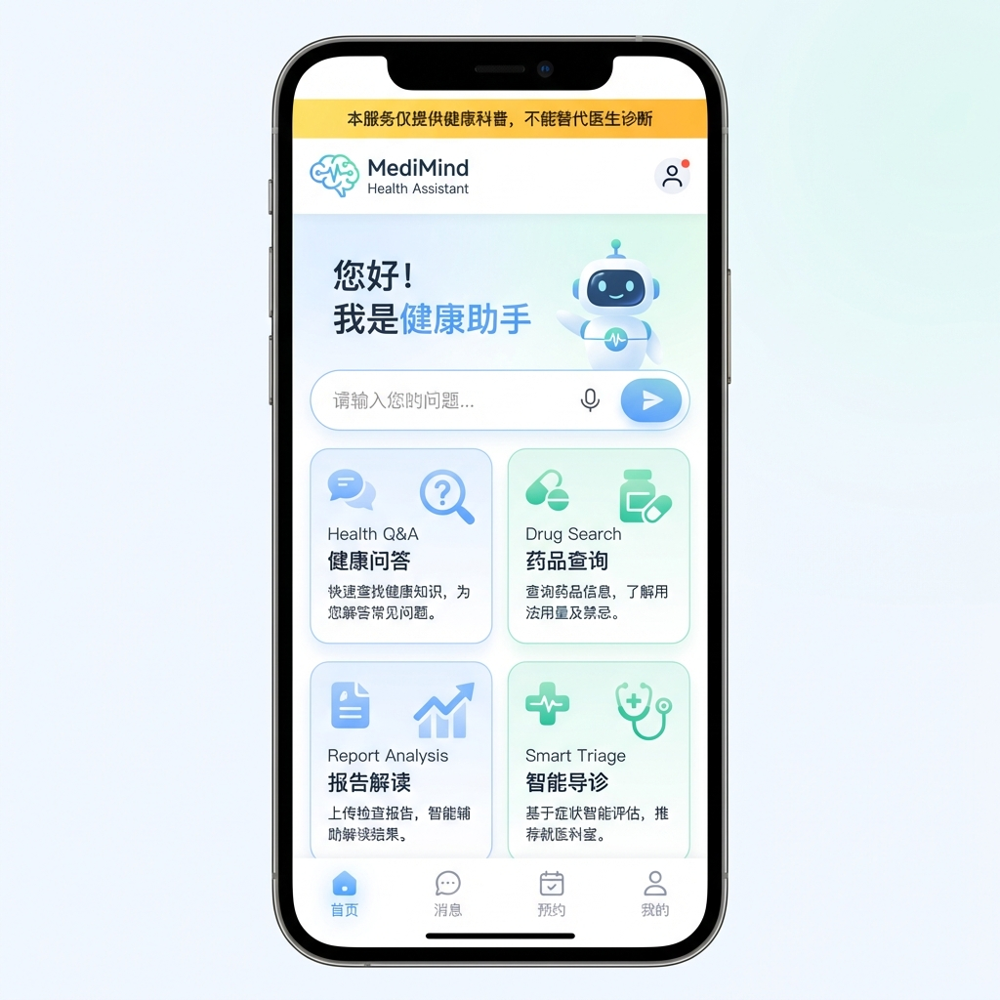
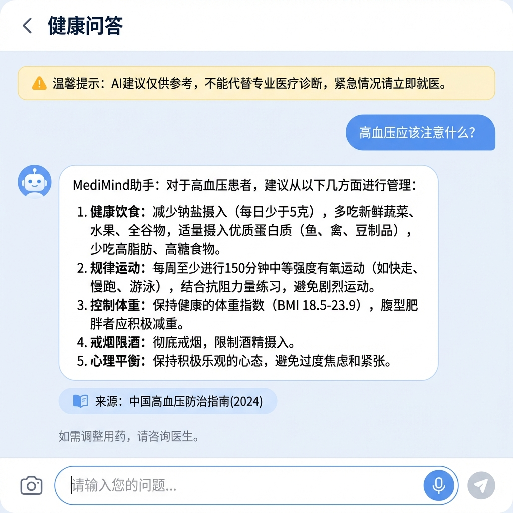
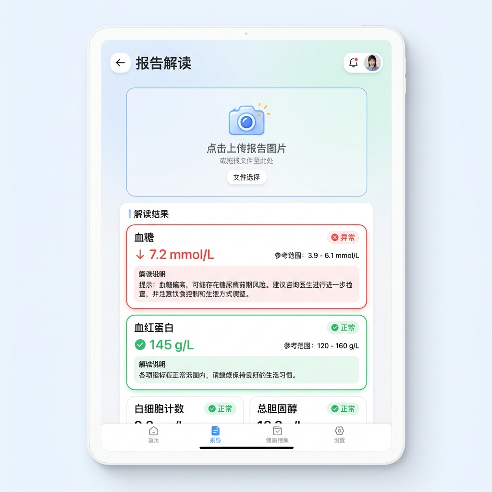

# MediMind - UI 设计规范

> 版本: v1.0  
> 更新日期: 2026-02-03

---

## 1. 设计概览

### 1.1 设计理念

MediMind 采用清新专业的医疗健康主题设计，强调：

- **专业可信**：医疗健康产品的专业视觉质感
- **温和友好**：柔和配色减少用户焦虑感
- **清晰易读**：信息层级分明，重点突出
- **安全提示**：合规声明和警示信息醒目

### 1.2 设计原则

1. **安全第一**：紧急提醒、免责声明等安全信息优先展示
2. **简洁直观**：健康信息清晰易懂，避免专业术语堆砌
3. **情感关怀**：使用温暖色调和友好语言，减轻用户焦虑
4. **来源可溯**：信息来源清晰标注，增强可信度

### 1.3 设计稿预览

#### 首页设计



**设计说明**：

- 顶部黄色安全提醒横幅
- 中央欢迎语和智能助手头像
- 大幅输入框支持语音和图片
- 四个功能卡片：健康问答、药品查询、报告解读、智能导诊

---

#### 健康问答页面



**设计说明**：

- 顶部安全提醒横幅
- 用户消息蓝色气泡，AI回复白色卡片
- AI回复包含结构化健康建议
- 底部来源引用和就医建议提示

---

#### 报告解读页面



**设计说明**：

- 顶部图片上传区域
- 解读结果卡片式展示
- 异常指标红色高亮，正常指标绿色标记
- 每项指标显示数值、参考范围和解读说明

---

## 2. 设计规范

### 2.1 色彩系统

#### 主色调

| 名称     | 色值      | 用途           |
| -------- | --------- | -------------- |
| 主背景   | `#f8fafc` | 页面主背景     |
| 卡片背景 | `#ffffff` | 卡片、对话气泡 |
| 边框色   | `#e2e8f0` | 分割线、边框   |

#### 强调色

| 名称   | 色值      | 用途               |
| ------ | --------- | ------------------ |
| 医疗蓝 | `#0ea5e9` | 主按钮、链接、高亮 |
| 健康绿 | `#22c55e` | 正常状态、成功提示 |
| 护理紫 | `#8b5cf6` | 次要强调           |

#### 警示色

| 名称   | 色值      | 用途           |
| ------ | --------- | -------------- |
| 警告橙 | `#f97316` | 警告信息       |
| 危险红 | `#ef4444` | 紧急提醒、异常 |
| 提示黄 | `#eab308` | 注意事项       |

#### 文字色

| 名称   | 色值      | 用途       |
| ------ | --------- | ---------- |
| 主文字 | `#1e293b` | 标题、正文 |
| 次文字 | `#64748b` | 辅助信息   |
| 弱文字 | `#94a3b8` | 占位符     |

### 2.2 字体规范

```css
/* 字体族 */
font-family:
  "Inter",
  "PingFang SC",
  -apple-system,
  sans-serif;

/* 字体大小 */
--text-xs: 12px; /* 辅助说明 */
--text-sm: 14px; /* 次要文字 */
--text-base: 16px; /* 正文 */
--text-lg: 18px; /* 小标题 */
--text-xl: 20px; /* 标题 */
--text-2xl: 24px; /* 页面标题 */

/* 行高 */
--leading-normal: 1.5;
--leading-relaxed: 1.75;
```

### 2.3 间距与圆角

```css
/* 间距 */
--space-1: 4px;
--space-2: 8px;
--space-3: 12px;
--space-4: 16px;
--space-6: 24px;
--space-8: 32px;

/* 圆角 */
--radius-sm: 4px;
--radius-md: 8px;
--radius-lg: 12px;
--radius-xl: 16px;
--radius-full: 9999px;
```

---

## 3. 页面布局

### 3.1 首页布局

```
┌─────────────────────────────────────────────────────────────┐
│  🏥 MediMind 健康助手                              登录     │
├─────────────────────────────────────────────────────────────┤
│                                                             │
│  ┌─────────────────────────────────────────────────────┐   │
│  │ ⚠️ 本服务仅提供健康科普，不能替代医生诊断            │   │
│  └─────────────────────────────────────────────────────┘   │
│                                                             │
│                    🏥 您好！我是健康助手                     │
│               有任何健康问题，都可以问我哦 💬               │
│                                                             │
│  ┌─────────────────────────────────────────────────────┐   │
│  │ 请输入您的健康问题...                          🎤 📷 │   │
│  └─────────────────────────────────────────────────────┘   │
│                                                             │
│  ┌────────────┐  ┌────────────┐                           │
│  │ 🔍 健康问答 │  │ 💊 药品查询 │                           │
│  │ 疾病、营养 │  │ 说明书查询 │                           │
│  │ 运动、预防 │  │ 用药指导   │                           │
│  └────────────┘  └────────────┘                           │
│                                                             │
│  ┌────────────┐  ┌────────────┐                           │
│  │ 📋 报告解读 │  │ 🏥 智能导诊 │                           │
│  │ 体检报告   │  │ 症状分析   │                           │
│  │ 化验单     │  │ 科室推荐   │                           │
│  └────────────┘  └────────────┘                           │
│                                                             │
└─────────────────────────────────────────────────────────────┘
```

### 3.2 对话页布局

```
┌─────────────────────────────────────────────────────────────┐
│  ← 返回    🔍 健康问答                                       │
├─────────────────────────────────────────────────────────────┤
│                                                             │
│  ┌───────────────────────────────────────────────────────┐ │
│  │ ⚕️ 温馨提示：以下信息仅供参考，如有健康问题请就医    │ │
│  └───────────────────────────────────────────────────────┘ │
│                                                             │
│                    ┌─────────────────────────────────────┐ │
│                    │ 高血压应该注意什么？                │ │
│                    │                                     │ │
│                    └─────────────────────────────────────┘ │
│                                                 用户消息    │
│                                                             │
│  ┌─────────────────────────────────────────────────────┐   │
│  │ 高血压患者需要注意以下几点：                         │   │
│  │                                                      │   │
│  │ 1. 饮食方面                                          │   │
│  │    • 限制盐摄入（每日不超过6g）                      │   │
│  │    • 多吃蔬菜水果                                    │   │
│  │    ...                                               │   │
│  │                                                      │   │
│  │ 📖 来源：《中国高血压防治指南(2024)》               │   │
│  │                                                      │   │
│  │ ⚕️ 如需调整用药，请咨询医生                         │   │
│  └─────────────────────────────────────────────────────┘   │
│  AI回复                                                     │
│                                                             │
├─────────────────────────────────────────────────────────────┤
│  ┌─────────────────────────────────────────────────────┐   │
│  │ 请输入您的问题...                              📷 🎤 │   │
│  └─────────────────────────────────────────────────────┘   │
└─────────────────────────────────────────────────────────────┘
```

### 3.3 报告解读页布局

```
┌─────────────────────────────────────────────────────────────┐
│  ← 返回    📋 报告解读                                       │
├─────────────────────────────────────────────────────────────┤
│                                                             │
│  ┌─────────────────────────────────────────────────────┐   │
│  │                                                      │   │
│  │        ┌───────────────────────────────┐            │   │
│  │        │         📷                     │            │   │
│  │        │    点击上传报告图片            │            │   │
│  │        │    支持 JPG、PNG 格式          │            │   │
│  │        └───────────────────────────────┘            │   │
│  │                                                      │   │
│  └─────────────────────────────────────────────────────┘   │
│                                                             │
│  ─────────────── 解读结果 ───────────────                   │
│                                                             │
│  ⚠️ 发现 3 项异常指标                                       │
│                                                             │
│  ┌─────────────────────────────────────────────────────┐   │
│  │ 🔴 血糖 (空腹)                                       │   │
│  │ 检测值: 7.2 mmol/L    参考值: 3.9-6.1                │   │
│  │                                                      │   │
│  │ 💡 说明：空腹血糖偏高，可能存在糖代谢异常。          │   │
│  │ 👨‍⚕️ 建议：建议至内分泌科就诊进一步检查。            │   │
│  └─────────────────────────────────────────────────────┘   │
│                                                             │
│  ┌─────────────────────────────────────────────────────┐   │
│  │ 🟢 血红蛋白                                          │   │
│  │ 检测值: 145 g/L       参考值: 130-175               │   │
│  │ ✅ 正常                                              │   │
│  └─────────────────────────────────────────────────────┘   │
│                                                             │
└─────────────────────────────────────────────────────────────┘
```

---

## 4. 组件规范

### 4.1 安全提醒横幅

```css
.safety-banner {
  background: linear-gradient(135deg, #fef3c7, #fde68a);
  border: 1px solid #fcd34d;
  border-radius: 8px;
  padding: 12px 16px;
  color: #92400e;
  font-size: 14px;
}

.safety-banner.emergency {
  background: linear-gradient(135deg, #fee2e2, #fecaca);
  border-color: #f87171;
  color: #b91c1c;
}
```

### 4.2 消息气泡

```css
/* 用户消息 */
.message-user {
  background: linear-gradient(135deg, #0ea5e9, #0284c7);
  color: #ffffff;
  border-radius: 16px 16px 4px 16px;
  padding: 12px 16px;
  max-width: 70%;
  margin-left: auto;
}

/* AI 消息 */
.message-ai {
  background: #ffffff;
  border: 1px solid #e2e8f0;
  color: #1e293b;
  border-radius: 16px 16px 16px 4px;
  padding: 16px;
  max-width: 85%;
}
```

### 4.3 来源引用卡片

```css
.source-card {
  background: #f1f5f9;
  border-left: 3px solid #0ea5e9;
  border-radius: 0 8px 8px 0;
  padding: 8px 12px;
  font-size: 13px;
  color: #64748b;
  margin-top: 8px;
}

.source-card .title {
  color: #0ea5e9;
  font-weight: 500;
}
```

### 4.4 指标状态卡片

```css
.lab-item-card {
  background: #ffffff;
  border: 1px solid #e2e8f0;
  border-radius: 12px;
  padding: 16px;
  margin-bottom: 12px;
}

.lab-item-card.normal {
  border-left: 4px solid #22c55e;
}

.lab-item-card.high,
.lab-item-card.low {
  border-left: 4px solid #ef4444;
  background: #fef2f2;
}

.lab-item-card.warning {
  border-left: 4px solid #f97316;
  background: #fff7ed;
}
```

### 4.5 功能入口卡片

```css
.feature-card {
  background: #ffffff;
  border: 1px solid #e2e8f0;
  border-radius: 16px;
  padding: 20px;
  text-align: center;
  cursor: pointer;
  transition: all 0.2s ease;
}

.feature-card:hover {
  border-color: #0ea5e9;
  box-shadow: 0 4px 12px rgba(14, 165, 233, 0.15);
  transform: translateY(-2px);
}

.feature-card .icon {
  font-size: 32px;
  margin-bottom: 12px;
}

.feature-card .title {
  font-size: 16px;
  font-weight: 600;
  color: #1e293b;
}

.feature-card .description {
  font-size: 13px;
  color: #64748b;
  margin-top: 4px;
}
```

---

## 5. 图标规范

使用 **Lucide Icons** 图标库：

| 图标            | 用途      |
| --------------- | --------- |
| `Heart`         | 健康/医疗 |
| `Pill`          | 药品      |
| `FileText`      | 报告/文档 |
| `Stethoscope`   | 导诊/问诊 |
| `AlertTriangle` | 警告      |
| `AlertCircle`   | 紧急      |
| `CheckCircle`   | 正常/成功 |
| `Info`          | 提示信息  |
| `Camera`        | 拍照上传  |
| `Mic`           | 语音输入  |
| `Send`          | 发送      |
| `ArrowLeft`     | 返回      |

---

## 6. 动效规范

### 6.1 过渡动画

```css
/* 默认过渡 */
transition: all 0.2s ease;

/* 卡片悬停 */
transition:
  transform 0.2s ease,
  box-shadow 0.2s ease;

/* 消息出现 */
animation: messageIn 0.3s ease-out;

@keyframes messageIn {
  from {
    opacity: 0;
    transform: translateY(10px);
  }
  to {
    opacity: 1;
    transform: translateY(0);
  }
}
```

### 6.2 加载状态

```css
/* 打字机效果 */
.typing-indicator {
  display: flex;
  gap: 4px;
}

.typing-indicator span {
  width: 8px;
  height: 8px;
  background: #94a3b8;
  border-radius: 50%;
  animation: typing 1.4s infinite ease-in-out;
}

@keyframes typing {
  0%,
  80%,
  100% {
    transform: scale(0.8);
    opacity: 0.5;
  }
  40% {
    transform: scale(1);
    opacity: 1;
  }
}
```

---

## 7. 响应式设计

### 7.1 断点设置

```css
/* 移动端 */
@media (max-width: 640px) {
  .feature-grid {
    grid-template-columns: 1fr;
  }
}

/* 平板 */
@media (min-width: 641px) and (max-width: 1024px) {
  .feature-grid {
    grid-template-columns: repeat(2, 1fr);
  }
}

/* 桌面 */
@media (min-width: 1025px) {
  .feature-grid {
    grid-template-columns: repeat(4, 1fr);
  }
}
```

---

## 8. 无障碍设计

- 所有交互元素可通过键盘访问
- 图标配有 aria-label
- 颜色对比度符合 WCAG AA 标准
- 警告信息使用图标 + 文字双重提示
