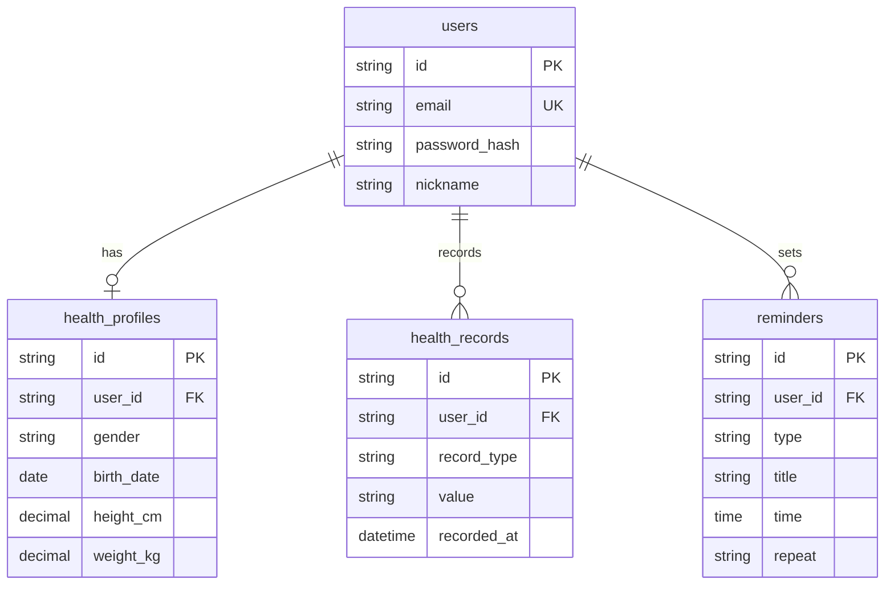

# MediMind 第二期 - 数据库设计文档

> 版本: v2.0  
> 更新日期: 2026-02-04

---

## 1. 数据模型总览

```
┌──────────────┐     ┌──────────────┐     ┌──────────────┐
│    User      │────<│ HealthProfile│     │   Hospital   │
└──────────────┘     └──────────────┘     └──────────────┘
       │                    │
       │                    │
       ▼                    ▼
┌──────────────┐     ┌──────────────┐
│  Reminder    │     │ HealthRecord │
└──────────────┘     └──────────────┘
```

---

## 2. 表结构设计

### 2.1 users (用户表)

| 字段          | 类型         | 约束             | 说明     |
| ------------- | ------------ | ---------------- | -------- |
| id            | VARCHAR(36)  | PK               | 用户 ID  |
| email         | VARCHAR(255) | UNIQUE, NOT NULL | 邮箱     |
| password_hash | VARCHAR(255) | NOT NULL         | 密码哈希 |
| nickname      | VARCHAR(100) |                  | 昵称     |
| avatar_url    | VARCHAR(500) |                  | 头像 URL |
| is_active     | BOOLEAN      | DEFAULT TRUE     | 账号状态 |
| created_at    | DATETIME     |                  | 创建时间 |
| updated_at    | DATETIME     |                  | 更新时间 |
| last_login_at | DATETIME     |                  | 最后登录 |

**索引**:

- `idx_users_email` (email)

---

### 2.2 health_profiles (健康档案表)

| 字段            | 类型         | 约束       | 说明          |
| --------------- | ------------ | ---------- | ------------- |
| id              | VARCHAR(36)  | PK         | 档案 ID       |
| user_id         | VARCHAR(36)  | FK, UNIQUE | 用户 ID       |
| gender          | VARCHAR(10)  |            | male/female   |
| birth_date      | DATE         |            | 出生日期      |
| height_cm       | DECIMAL(5,1) |            | 身高 (cm)     |
| weight_kg       | DECIMAL(5,1) |            | 体重 (kg)     |
| blood_type      | VARCHAR(10)  |            | 血型          |
| allergies       | TEXT         |            | 过敏史 (JSON) |
| medical_history | TEXT         |            | 病史 (JSON)   |
| created_at      | DATETIME     |            | 创建时间      |
| updated_at      | DATETIME     |            | 更新时间      |

---

### 2.3 health_records (健康记录表)

| 字段        | 类型         | 约束     | 说明     |
| ----------- | ------------ | -------- | -------- |
| id          | VARCHAR(36)  | PK       | 记录 ID  |
| user_id     | VARCHAR(36)  | FK       | 用户 ID  |
| record_type | VARCHAR(50)  | NOT NULL | 类型     |
| value       | VARCHAR(100) | NOT NULL | 数值     |
| unit        | VARCHAR(20)  |          | 单位     |
| recorded_at | DATETIME     | NOT NULL | 记录时间 |
| notes       | TEXT         |          | 备注     |
| created_at  | DATETIME     |          | 创建时间 |

**record_type 枚举**:

- `blood_pressure` - 血压 (格式: 120/80)
- `blood_sugar` - 血糖 (mmol/L)
- `heart_rate` - 心率 (次/分)
- `weight` - 体重 (kg)
- `temperature` - 体温 (℃)

**索引**:

- `idx_records_user_type` (user_id, record_type)
- `idx_records_recorded_at` (recorded_at)

---

### 2.4 reminders (提醒表)

| 字段           | 类型         | 约束         | 说明     |
| -------------- | ------------ | ------------ | -------- |
| id             | VARCHAR(36)  | PK           | 提醒 ID  |
| user_id        | VARCHAR(36)  | FK           | 用户 ID  |
| type           | VARCHAR(50)  | NOT NULL     | 类型     |
| title          | VARCHAR(200) | NOT NULL     | 标题     |
| description    | TEXT         |              | 描述     |
| time           | TIME         | NOT NULL     | 提醒时间 |
| repeat         | VARCHAR(20)  |              | 重复规则 |
| enabled        | BOOLEAN      | DEFAULT TRUE | 是否启用 |
| last_triggered | DATETIME     |              | 上次触发 |
| created_at     | DATETIME     |              | 创建时间 |
| updated_at     | DATETIME     |              | 更新时间 |

**type 枚举**:

- `medication` - 用药提醒
- `checkup` - 复诊提醒
- `measurement` - 测量提醒

**repeat 枚举**:

- `daily` - 每天
- `weekly` - 每周
- `monthly` - 每月
- `once` - 一次性

---

### 2.5 hospitals (医院表)

| 字段        | 类型          | 约束     | 说明               |
| ----------- | ------------- | -------- | ------------------ |
| id          | VARCHAR(36)   | PK       | 医院 ID            |
| name        | VARCHAR(200)  | NOT NULL | 名称               |
| level       | VARCHAR(20)   |          | 等级 (三甲/三乙等) |
| type        | VARCHAR(50)   |          | 类型 (综合/专科)   |
| province    | VARCHAR(50)   |          | 省份               |
| city        | VARCHAR(50)   |          | 城市               |
| district    | VARCHAR(50)   |          | 区县               |
| address     | VARCHAR(500)  |          | 详细地址           |
| phone       | VARCHAR(50)   |          | 电话               |
| latitude    | DECIMAL(10,7) |          | 纬度               |
| longitude   | DECIMAL(10,7) |          | 经度               |
| departments | TEXT          |          | 科室列表 (JSON)    |

**索引**:

- `idx_hospitals_city` (city)
- `idx_hospitals_level` (level)

---

## 3. 关系图



---

## 4. 迁移策略

### 4.1 增量迁移

第二期新增表不影响现有功能，采用增量迁移：

```sql
-- Migration 001: Create users table
CREATE TABLE users (...);

-- Migration 002: Create health_profiles table
CREATE TABLE health_profiles (...);

-- Migration 003: Create health_records table
CREATE TABLE health_records (...);

-- Migration 004: Create reminders table
CREATE TABLE reminders (...);
```

### 4.2 数据初始化

医院数据需要预先导入：

- 数据来源：国家卫健委医院名录
- 预计数据量：~30,000 条
