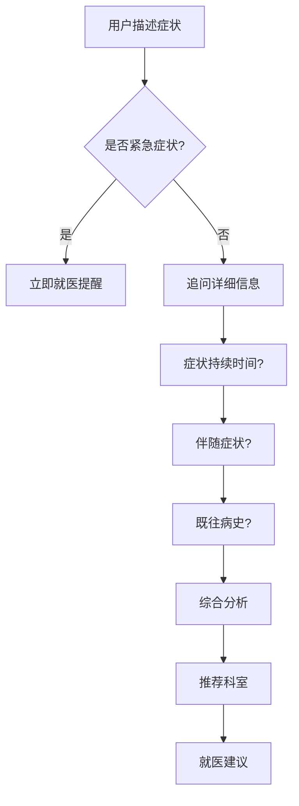

# MediMind - 产品需求文档 (PRD)

> 版本: v1.0  
> 更新日期: 2026-02-03  
> 项目类型: LLM 课程毕业项目

---

## 1. 项目背景

### 1.1 项目定位

MediMind 是一款**面向患者的智能健康信息服务平台**。通过结合 RAG 知识检索、多模态理解和 Agent 智能交互技术，帮助用户获取权威健康知识、理解检查报告、查询药品信息，并在必要时引导就医。

> [!IMPORTANT]
> **合规声明**：MediMind 定位为"健康信息服务"而非"医疗诊断服务"。所有功能仅提供健康科普和信息查询，明确声明不提供诊断、处方或治疗建议。

### 1.2 目标用户

| 用户类型   | 典型场景                   | 核心诉求               |
| ---------- | -------------------------- | ---------------------- |
| 健康关注者 | 日常健康知识查询、预防保健 | 获取权威可靠的健康信息 |
| 慢性病患者 | 了解疾病知识、用药注意事项 | 疾病管理、用药指导     |
| 患者家属   | 照护知识学习、康复指导     | 辅助照护、理解病情     |
| 体检人群   | 体检报告解读、指标理解     | 看懂报告、了解注意事项 |

### 1.3 产品愿景

> "让每个人都能获得专业、可靠的健康信息服务"

---

## 2. 功能需求

### 2.1 核心功能架构

```
┌─────────────────────────────────────────────────────────────┐
│                    MediMind 功能架构                         │
├─────────────────────────────────────────────────────────────┤
│                                                             │
│  ┌──────────────┐  ┌──────────────┐  ┌──────────────┐      │
│  │  健康知识问答 │  │  药品信息查询 │  │  报告解读助手 │      │
│  └──────┬───────┘  └──────┬───────┘  └──────┬───────┘      │
│         │                 │                 │               │
│  ┌──────▼───────┐  ┌──────▼───────┐  ┌──────▼───────┐      │
│  │ · 疾病科普    │  │ · 药品说明书  │  │ · 体检报告    │      │
│  │ · 营养健康    │  │ · 用药注意    │  │ · 化验单      │      │
│  │ · 运动康复    │  │ · 相互作用    │  │ · 指标解释    │      │
│  │ · 预防保健    │  │ · 同类对比    │  │ · 异常提示    │      │
│  └──────────────┘  └──────────────┘  └──────────────┘      │
│                                                             │
│  ┌──────────────┐  ┌──────────────┐                        │
│  │  智能导诊     │  │  安全护栏     │                        │
│  └──────┬───────┘  └──────┬───────┘                        │
│         │                 │                                 │
│  ┌──────▼───────┐  ┌──────▼───────┐                        │
│  │ · 症状分析    │  │ · 敏感问题拦截│                        │
│  │ · 科室推荐    │  │ · 紧急就医提醒│                        │
│  │ · 就医建议    │  │ · 来源引用    │                        │
│  └──────────────┘  └──────────────┘                        │
│                                                             │
└─────────────────────────────────────────────────────────────┘
```

### 2.2 功能详细说明

#### 2.2.1 健康知识问答模块

| 功能项   | 描述                              | 优先级 |
| -------- | --------------------------------- | ------ |
| 疾病科普 | 常见疾病的病因、症状、预防知识    | P0     |
| 营养健康 | 饮食建议、营养素知识、食疗方案    | P1     |
| 运动康复 | 运动指导、康复训练、运动禁忌      | P1     |
| 预防保健 | 体检建议、疫苗接种、健康生活方式  | P1     |
| 来源引用 | 每个回答标注信息来源（指南/文献） | P0     |

**问答处理流程**：

```
用户提问 → 安全检查 → 问题向量化 → 知识检索 → Prompt构建 → LLM生成 → 来源标注 → 返回答案
```

#### 2.2.2 药品信息查询模块

| 功能项     | 描述                     | 优先级 |
| ---------- | ------------------------ | ------ |
| 药品搜索   | 按名称、适应症搜索药品   | P0     |
| 说明书查询 | 完整药品说明书信息       | P0     |
| 用法用量   | 服用方法、剂量、注意事项 | P0     |
| 相互作用   | 药物间相互作用检查       | P1     |
| 同类对比   | 同类药品的功效对比       | P2     |

#### 2.2.3 报告解读模块（多模态）

| 功能项   | 描述                         | 优先级 |
| -------- | ---------------------------- | ------ |
| 图片上传 | 支持上传体检报告/化验单图片  | P0     |
| OCR 识别 | 自动识别报告中的文字和数值   | P0     |
| 指标解读 | 解释各项指标的含义和正常范围 | P0     |
| 异常提示 | 标注异常指标并给出科普解释   | P0     |
| 就医建议 | 根据异常情况建议是否需要就医 | P1     |

#### 2.2.4 智能导诊模块（Agent）

| 功能项   | 描述                       | 优先级 |
| -------- | -------------------------- | ------ |
| 症状收集 | 引导式多轮对话收集症状信息 | P0     |
| 症状分析 | 基于症状进行初步分析       | P0     |
| 科室推荐 | 推荐应该就诊的科室         | P0     |
| 就医建议 | 是否需要紧急就医的建议     | P0     |
| 注意事项 | 就诊前的准备和注意事项     | P1     |

**导诊流程**：



---

## 3. 非功能需求

### 3.1 性能需求

| 指标         | 要求                   |
| ------------ | ---------------------- |
| 问答响应延迟 | 首字输出 < 2秒（流式） |
| 向量检索延迟 | < 500ms                |
| 图片识别延迟 | < 5秒                  |
| 并发支持     | ≥ 50 用户同时使用      |

### 3.2 安全需求

| 指标         | 要求                      |
| ------------ | ------------------------- |
| 敏感问题拦截 | 100% 拦截危险医疗建议请求 |
| 免责声明     | 每次对话展示合规声明      |
| 来源可溯     | 所有回答标注权威来源      |
| 紧急情况     | 识别紧急症状并提醒就医    |

### 3.3 合规需求

| 要求         | 实现方式                       |
| ------------ | ------------------------------ |
| 明确服务边界 | 开头声明"仅供参考，非医疗建议" |
| 拒绝诊断请求 | 检测诊断请求并婉拒             |
| 引导就医     | 在适当场景建议就医             |
| 数据来源标注 | 标注信息来自哪份指南或文献     |

---

## 4. 用户界面设计

### 4.1 页面结构

```
┌─────────────────────────────────────────────────────────────┐
│  🏥 MediMind 健康助手                          登录 | 设置   │
├─────────────────────────────────────────────────────────────┤
│                                                             │
│  ⚠️ 本服务仅提供健康科普，不能替代医生诊断                   │
│                                                             │
│  ┌─────────────────────────────────────────────────────┐   │
│  │ 请输入您的健康问题...                          🎤 📷 │   │
│  └─────────────────────────────────────────────────────┘   │
│                                                             │
│  ┌──────────┐ ┌──────────┐ ┌──────────┐ ┌──────────┐       │
│  │ 🔍       │ │ 💊       │ │ 📋       │ │ 🏥       │       │
│  │ 健康问答 │ │ 药品查询 │ │ 报告解读 │ │ 智能导诊 │       │
│  └──────────┘ └──────────┘ └──────────┘ └──────────┘       │
│                                                             │
└─────────────────────────────────────────────────────────────┘
```

### 4.2 核心页面

| 页面       | 说明                         |
| ---------- | ---------------------------- |
| 首页       | 快捷入口 + 对话框 + 合规声明 |
| 对话页     | 健康问答主交互界面           |
| 药品查询页 | 药品搜索和详情展示           |
| 报告解读页 | 图片上传和解读结果           |
| 导诊页     | 多轮对话式症状收集           |

---

## 5. 数据模型

### 5.1 核心实体

```
┌──────────────┐       ┌──────────────┐       ┌──────────────┐
│  MedicalDoc  │       │    Drug      │       │   LabIndex   │
├──────────────┤       ├──────────────┤       ├──────────────┤
│ id           │       │ id           │       │ id           │
│ title        │       │ name         │       │ name         │
│ category     │       │ generic_name │       │ normal_range │
│ content      │       │ indication   │       │ unit         │
│ source       │       │ dosage       │       │ description  │
│ embedding    │       │ interaction  │       │ high_meaning │
└──────────────┘       └──────────────┘       │ low_meaning  │
                                              └──────────────┘

┌──────────────┐       ┌──────────────┐
│ Conversation │       │   Message    │
├──────────────┤       ├──────────────┤
│ id           │──1:N──│ id           │
│ user_id      │       │ conv_id      │
│ type         │       │ role         │
│ created_at   │       │ content      │
└──────────────┘       │ sources      │
                       └──────────────┘
```

---

## 6. 验收标准

### 6.1 功能验收

- [ ] 能够回答常见健康问题（疾病、营养、运动）
- [ ] 回答包含来源引用
- [ ] 能够查询药品信息
- [ ] 能够上传并解读体检报告图片
- [ ] 支持智能导诊对话流程
- [ ] 敏感问题被正确拦截

### 6.2 合规验收

- [ ] 首页和对话中展示免责声明
- [ ] 拒绝诊断请求并引导就医
- [ ] 紧急症状触发就医提醒
- [ ] 所有回答标注信息来源

### 6.3 性能验收

- [ ] 问答首字输出 < 3秒
- [ ] 图片识别 < 5秒
- [ ] 系统支持 50 并发用户

---

## 7. 项目范围

### 7.1 本期包含 (In Scope)

- ✅ 健康知识问答（RAG）
- ✅ 药品信息查询
- ✅ 体检报告解读（多模态）
- ✅ 智能导诊（Agent）
- ✅ 安全护栏和合规机制
- ✅ Docker 部署

### 7.2 本期不包含 (Out of Scope)

- ❌ 用户登录认证系统
- ❌ 健康档案管理
- ❌ 在线问诊预约
- ❌ 医保相关功能

### 7.3 未来规划 (Future)

- 🔮 用户认证与健康档案
- 🔮 医院/医生推荐
- 🔮 慢病管理提醒
- 🔮 移动端适配

---

## 8. 风险评估

| 风险项           | 可能性 | 影响 | 缓解措施                    |
| ---------------- | ------ | ---- | --------------------------- |
| 回答医学错误     | 中     | 高   | 仅使用权威数据源 + 严格审核 |
| 用户过度依赖     | 中     | 高   | 强化免责声明 + 就医引导     |
| 合规风险         | 低     | 高   | 明确定位为健康信息服务      |
| 敏感问题处理不当 | 中     | 高   | 完善的安全护栏机制          |
| 数据隐私泄露     | 低     | 高   | 不存储用户健康数据          |

---

## 附录

### A. 术语表

| 术语       | 说明                                         |
| ---------- | -------------------------------------------- |
| RAG        | Retrieval-Augmented Generation，检索增强生成 |
| Agent      | 智能代理，具有推理和工具调用能力             |
| Guardrail  | 安全护栏，防止不当输出                       |
| Multimodal | 多模态，支持图像、文本等多种输入             |

### B. 数据来源

| 数据类型 | 来源                     |
| -------- | ------------------------ |
| 疾病科普 | 国家卫健委健康科普资源库 |
| 药品信息 | 国家药监局药品数据库     |
| 临床指南 | 中华医学会公开临床指南   |
| 检验指标 | 临床检验医学规范         |
