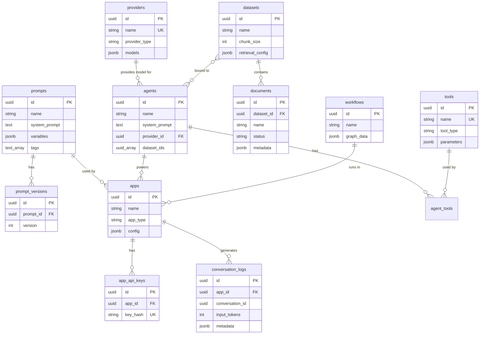

# Mini-Dify - 数据库设计文档

> 版本: v1.1  
> 更新日期: 2026-03-06  
> 数据库: PostgreSQL 16 + SQLAlchemy (async) + Alembic

---

## 1. 数据模型总览

```
┌──────────────┐     ┌──────────────┐     ┌──────────────┐
│  providers   │     │   prompts    │     │   datasets   │
│  (模型供应商) │     │ (Prompt模板) │     │  (知识库)     │
└──────────────┘     └──────┬───────┘     └──────┬───────┘
                            │                    │
                     ┌──────▼───────┐     ┌──────▼───────┐
                     │prompt_versions│     │  documents   │
                     │ (Prompt版本)  │     │  (文档)      │
                     └──────────────┘     └──────────────┘

┌──────────────┐     ┌──────────────┐     ┌──────────────┐
│   agents     │────〈│ agent_tools  │     │    tools     │
│  (智能体)    │     │ (关联表)     │────〈│  (工具)      │
└──────────────┘     └──────────────┘     └──────────────┘

┌──────────────┐     ┌──────────────┐
│  workflows   │     │    apps      │
│  (工作流)    │     │  (应用)      │
└──────────────┘     └──────┬───────┘
                            │
                     ┌──────▼───────┐     ┌──────────────┐
                     │  app_api_keys│     │conversation   │
                     │ (API密钥)    │     │  _logs        │
                     └──────────────┘     │ (对话日志)    │
                                          └──────────────┘
```

---

## 2. PostgreSQL 特性说明

本项目利用 PostgreSQL 的以下高级特性：

| 特性        | 用途                                           |
| ----------- | ---------------------------------------------- |
| UUID        | 原生 UUID 类型作为主键，无需 VARCHAR           |
| JSONB       | 存储可变结构数据（模型列表、变量定义、配置等） |
| TIMESTAMPTZ | 时区感知的时间戳                               |
| 数组        | 标签等多值字段                                 |
| GIN 索引    | JSONB 字段的高效查询                           |

---

## 3. 表结构设计

### 3.1 providers (模型供应商表)

| 字段          | 类型         | 约束             | 说明                                  |
| ------------- | ------------ | ---------------- | ------------------------------------- |
| id            | UUID         | PK, DEFAULT gen  | 供应商 ID                             |
| name          | VARCHAR(100) | UNIQUE, NOT NULL | 供应商名称                            |
| provider_type | VARCHAR(50)  | NOT NULL         | 类型 (openai/anthropic/google/ollama) |
| api_key       | TEXT         |                  | 加密存储的 API Key                    |
| base_url      | VARCHAR(500) |                  | 自定义 Base URL                       |
| models        | JSONB        |                  | 可用模型列表                          |
| config        | JSONB        |                  | 供应商特有配置（如默认参数）          |
| is_active     | BOOLEAN      | DEFAULT TRUE     | 是否启用                              |
| created_at    | TIMESTAMPTZ  | DEFAULT NOW()    | 创建时间                              |
| updated_at    | TIMESTAMPTZ  | DEFAULT NOW()    | 更新时间                              |

**SQLAlchemy 模型示例**:

```python
from sqlalchemy import Column, String, Boolean, text
from sqlalchemy.dialects.postgresql import UUID, JSONB, TIMESTAMP

class Provider(Base):
    __tablename__ = "providers"

    id = Column(UUID, primary_key=True, server_default=text("gen_random_uuid()"))
    name = Column(String(100), unique=True, nullable=False)
    provider_type = Column(String(50), nullable=False)
    api_key = Column(String, nullable=True)
    base_url = Column(String(500), nullable=True)
    models = Column(JSONB, default=list)
    config = Column(JSONB, default=dict)
    is_active = Column(Boolean, default=True)
    created_at = Column(TIMESTAMP(timezone=True), server_default=text("NOW()"))
    updated_at = Column(TIMESTAMP(timezone=True), server_default=text("NOW()"), onupdate=text("NOW()"))
```

**provider_type 枚举**: `openai`, `anthropic`, `google`, `ollama`

---

### 3.2 prompts (Prompt 模板表)

| 字段            | 类型         | 约束          | 说明             |
| --------------- | ------------ | ------------- | ---------------- |
| id              | UUID         | PK            | Prompt ID        |
| name            | VARCHAR(200) | NOT NULL      | 模板名称         |
| description     | TEXT         |               | 模板描述         |
| system_prompt   | TEXT         | NOT NULL      | System Prompt    |
| user_prompt     | TEXT         | NOT NULL      | User Prompt 模板 |
| variables       | JSONB        |               | 变量定义         |
| tags            | TEXT[]       |               | 标签数组         |
| current_version | INTEGER      | DEFAULT 1     | 当前版本号       |
| created_at      | TIMESTAMPTZ  | DEFAULT NOW() | 创建时间         |
| updated_at      | TIMESTAMPTZ  | DEFAULT NOW() | 更新时间         |

**索引**: `idx_prompts_tags` GIN (tags)

---

### 3.3 prompt_versions (Prompt 版本表)

| 字段          | 类型         | 约束          | 说明             |
| ------------- | ------------ | ------------- | ---------------- |
| id            | UUID         | PK            | 版本 ID          |
| prompt_id     | UUID         | FK            | 关联 Prompt ID   |
| version       | INTEGER      | NOT NULL      | 版本号           |
| system_prompt | TEXT         | NOT NULL      | System Prompt    |
| user_prompt   | TEXT         | NOT NULL      | User Prompt 模板 |
| change_note   | VARCHAR(500) |               | 变更说明         |
| created_at    | TIMESTAMPTZ  | DEFAULT NOW() | 创建时间         |

**索引**: `idx_prompt_versions_pid` UNIQUE (prompt_id, version)

---

### 3.4 datasets (知识库表)

| 字段             | 类型         | 约束                   | 说明                       |
| ---------------- | ------------ | ---------------------- | -------------------------- |
| id               | UUID         | PK                     | 知识库 ID                  |
| name             | VARCHAR(200) | NOT NULL               | 知识库名称                 |
| description      | TEXT         |                        | 描述                       |
| embedding_model  | VARCHAR(100) | DEFAULT 'bge-large-zh' | Embedding 模型             |
| chunk_size       | INTEGER      | DEFAULT 500            | 切分大小                   |
| chunk_overlap    | INTEGER      | DEFAULT 50             | 切分重叠                   |
| document_count   | INTEGER      | DEFAULT 0              | 文档数量                   |
| chunk_count      | INTEGER      | DEFAULT 0              | 总切片数                   |
| retrieval_config | JSONB        | DEFAULT '{}'           | 检索配置（策略、top_k 等） |
| created_at       | TIMESTAMPTZ  | DEFAULT NOW()          | 创建时间                   |
| updated_at       | TIMESTAMPTZ  | DEFAULT NOW()          | 更新时间                   |

---

### 3.5 documents (文档表)

| 字段        | 类型          | 约束              | 说明                                       |
| ----------- | ------------- | ----------------- | ------------------------------------------ |
| id          | UUID          | PK                | 文档 ID                                    |
| dataset_id  | UUID          | FK                | 关联知识库 ID                              |
| name        | VARCHAR(500)  | NOT NULL          | 文件名                                     |
| file_path   | VARCHAR(1000) |                   | 文件存储路径                               |
| file_type   | VARCHAR(20)   | NOT NULL          | 文件类型 (pdf/md/txt/docx)                 |
| file_size   | BIGINT        |                   | 文件大小 (bytes)                           |
| chunk_count | INTEGER       | DEFAULT 0         | 切片数量                                   |
| metadata    | JSONB         | DEFAULT '{}'      | 文档元数据（页数、作者等）                 |
| status      | VARCHAR(20)   | DEFAULT 'pending' | 状态 (pending/processing/completed/failed) |
| error_msg   | TEXT          |                   | 处理失败时的错误信息                       |
| created_at  | TIMESTAMPTZ   | DEFAULT NOW()     | 创建时间                                   |

**索引**: `idx_documents_dataset` (dataset_id)

---

### 3.6 tools (工具表)

| 字段        | 类型         | 约束             | 说明                  |
| ----------- | ------------ | ---------------- | --------------------- |
| id          | UUID         | PK               | 工具 ID               |
| name        | VARCHAR(100) | UNIQUE, NOT NULL | 工具名称              |
| description | TEXT         |                  | 工具描述              |
| tool_type   | VARCHAR(20)  | NOT NULL         | 类型 (builtin/custom) |
| parameters  | JSONB        |                  | 参数 Schema           |
| code        | TEXT         |                  | 自定义工具代码        |
| is_active   | BOOLEAN      | DEFAULT TRUE     | 是否启用              |
| created_at  | TIMESTAMPTZ  | DEFAULT NOW()    | 创建时间              |

---

### 3.7 agents (智能体表)

| 字段          | 类型             | 约束            | 说明                          |
| ------------- | ---------------- | --------------- | ----------------------------- |
| id            | UUID             | PK              | Agent ID                      |
| name          | VARCHAR(200)     | NOT NULL        | Agent 名称                    |
| description   | TEXT             |                 | 描述                          |
| system_prompt | TEXT             | NOT NULL        | 系统提示词                    |
| provider_id   | UUID             | FK              | 模型供应商 ID                 |
| model_name    | VARCHAR(100)     | NOT NULL        | 模型名称                      |
| temperature   | DOUBLE PRECISION | DEFAULT 0.7     | 温度                          |
| max_tokens    | INTEGER          | DEFAULT 2048    | 最大 Token                    |
| strategy      | VARCHAR(20)      | DEFAULT 'react' | 策略 (react/function_calling) |
| dataset_ids   | UUID[]           |                 | 关联知识库 ID 数组            |
| created_at    | TIMESTAMPTZ      | DEFAULT NOW()   | 创建时间                      |
| updated_at    | TIMESTAMPTZ      | DEFAULT NOW()   | 更新时间                      |

---

### 3.8 agent_tools (Agent-工具关联表)

| 字段     | 类型 | 约束 | 说明     |
| -------- | ---- | ---- | -------- |
| agent_id | UUID | FK   | Agent ID |
| tool_id  | UUID | FK   | 工具 ID  |

**联合主键**: (agent_id, tool_id)

---

### 3.9 workflows (工作流表)

| 字段        | 类型         | 约束            | 说明                   |
| ----------- | ------------ | --------------- | ---------------------- |
| id          | UUID         | PK              | 工作流 ID              |
| name        | VARCHAR(200) | NOT NULL        | 工作流名称             |
| description | TEXT         |                 | 描述                   |
| graph_data  | JSONB        | NOT NULL        | 工作流图定义           |
| status      | VARCHAR(20)  | DEFAULT 'draft' | 状态 (draft/published) |
| created_at  | TIMESTAMPTZ  | DEFAULT NOW()   | 创建时间               |
| updated_at  | TIMESTAMPTZ  | DEFAULT NOW()   | 更新时间               |

**graph_data JSONB 结构**:

```json
{
  "nodes": [
    {
      "id": "node_1",
      "type": "start",
      "position": { "x": 0, "y": 0 },
      "config": {}
    },
    {
      "id": "node_2",
      "type": "llm",
      "position": { "x": 200, "y": 0 },
      "config": {
        "provider_id": "xxx",
        "model": "gpt-4o",
        "prompt": "..."
      }
    },
    {
      "id": "node_3",
      "type": "end",
      "position": { "x": 400, "y": 0 },
      "config": {}
    }
  ],
  "edges": [
    { "source": "node_1", "target": "node_2" },
    { "source": "node_2", "target": "node_3" }
  ]
}
```

> [!TIP]
> 使用 PostgreSQL JSONB 类型存储 `graph_data`，支持对节点/边的局部查询和索引，比 TEXT 存储 JSON 字符串更高效。

---

### 3.10 apps (应用表)

| 字段         | 类型         | 约束          | 说明                               |
| ------------ | ------------ | ------------- | ---------------------------------- |
| id           | UUID         | PK            | 应用 ID                            |
| name         | VARCHAR(200) | NOT NULL      | 应用名称                           |
| description  | TEXT         |               | 描述                               |
| app_type     | VARCHAR(20)  | NOT NULL      | 类型 (chatbot/completion/workflow) |
| config       | JSONB        | NOT NULL      | 应用配置                           |
| is_published | BOOLEAN      | DEFAULT FALSE | 是否已发布                         |
| created_at   | TIMESTAMPTZ  | DEFAULT NOW() | 创建时间                           |
| updated_at   | TIMESTAMPTZ  | DEFAULT NOW() | 更新时间                           |

**config JSONB 结构** (按类型):

```json
// Chatbot
{ "agent_id": "uuid", "welcome_message": "你好！", "suggested_questions": ["..."] }

// Completion
{ "prompt_id": "uuid", "provider_id": "uuid", "model": "gpt-4o" }

// Workflow
{ "workflow_id": "uuid" }
```

---

### 3.11 app_api_keys (应用 API 密钥表)

| 字段       | 类型         | 约束             | 说明         |
| ---------- | ------------ | ---------------- | ------------ |
| id         | UUID         | PK               | Key ID       |
| app_id     | UUID         | FK               | 关联应用 ID  |
| key_prefix | VARCHAR(10)  | NOT NULL         | Key 前缀     |
| key_hash   | VARCHAR(255) | NOT NULL, UNIQUE | Key 哈希     |
| name       | VARCHAR(100) |                  | Key 名称     |
| is_active  | BOOLEAN      | DEFAULT TRUE     | 是否启用     |
| last_used  | TIMESTAMPTZ  |                  | 最后使用时间 |
| created_at | TIMESTAMPTZ  | DEFAULT NOW()    | 创建时间     |

---

### 3.12 conversation_logs (对话日志表)

| 字段            | 类型         | 约束          | 说明                   |
| --------------- | ------------ | ------------- | ---------------------- |
| id              | UUID         | PK            | 日志 ID                |
| app_id          | UUID         | FK            | 关联应用 ID            |
| conversation_id | UUID         | NOT NULL      | 对话 ID                |
| role            | VARCHAR(20)  | NOT NULL      | 角色 (user/assistant)  |
| content         | TEXT         | NOT NULL      | 消息内容               |
| provider_name   | VARCHAR(100) |               | 模型供应商             |
| model_name      | VARCHAR(100) |               | 模型名称               |
| input_tokens    | INTEGER      | DEFAULT 0     | 输入 Token 数          |
| output_tokens   | INTEGER      | DEFAULT 0     | 输出 Token 数          |
| latency_ms      | INTEGER      |               | 响应延迟 (ms)          |
| metadata        | JSONB        | DEFAULT '{}'  | 扩展数据（工具调用等） |
| created_at      | TIMESTAMPTZ  | DEFAULT NOW() | 创建时间               |

**索引**:

- `idx_logs_app` (app_id, created_at DESC)
- `idx_logs_conversation` (conversation_id)

---

## 4. ER 关系图



---

## 5. 数据库迁移策略

使用 **Alembic** 管理数据库 Schema 变更：

```bash
# 初始化 Alembic
cd backend
alembic init alembic

# 自动生成迁移
alembic revision --autogenerate -m "initial schema"

# 执行迁移
alembic upgrade head

# 回滚
alembic downgrade -1
```

**迁移文件命名约定**: `YYYYMMDD_HHMM_description.py`

---

## 6. 向量存储 (Milvus)

向量数据存储在 **Milvus** 中，不在 PostgreSQL 中。每个知识库对应一个 Milvus Collection。

### Collection Schema

| 字段        | 类型         | 说明          |
| ----------- | ------------ | ------------- |
| id          | VARCHAR(36)  | 主键          |
| content     | VARCHAR      | 文本内容      |
| document_id | VARCHAR(36)  | 关联文档 ID   |
| chunk_index | INT64        | 切片序号      |
| embedding   | FLOAT_VECTOR | 向量 (1024维) |

**索引**: IVF_FLAT, metric_type=COSINE

---

## 7. 初始数据

### 7.1 内置工具

```sql
INSERT INTO tools (name, description, tool_type, parameters) VALUES
('web_search', '搜索互联网获取实时信息', 'builtin', '{"query": {"type": "string", "required": true}}'),
('calculator', '执行数学运算', 'builtin', '{"expression": {"type": "string", "required": true}}'),
('code_runner', '执行 Python 代码', 'builtin', '{"code": {"type": "string", "required": true}}'),
('http_request', '发送 HTTP 请求', 'builtin', '{"url": {"type": "string", "required": true}, "method": {"type": "string"}, "body": {"type": "string"}}'),
('knowledge_retrieval', '从知识库中检索相关内容', 'builtin', '{"query": {"type": "string", "required": true}, "dataset_id": {"type": "string", "required": true}}');
```
